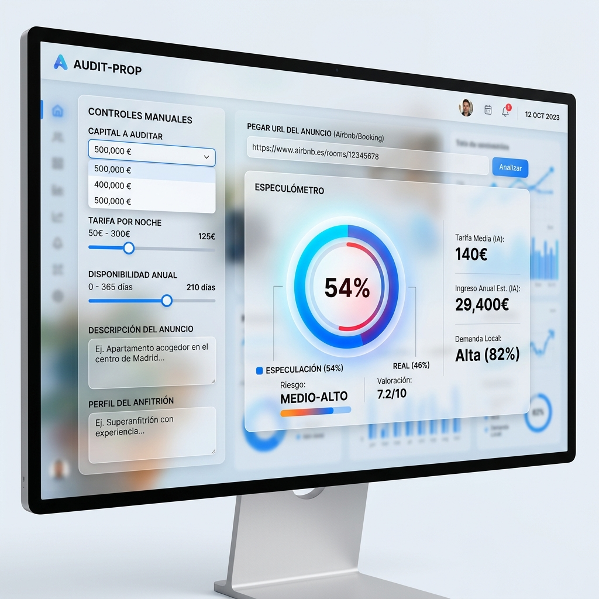
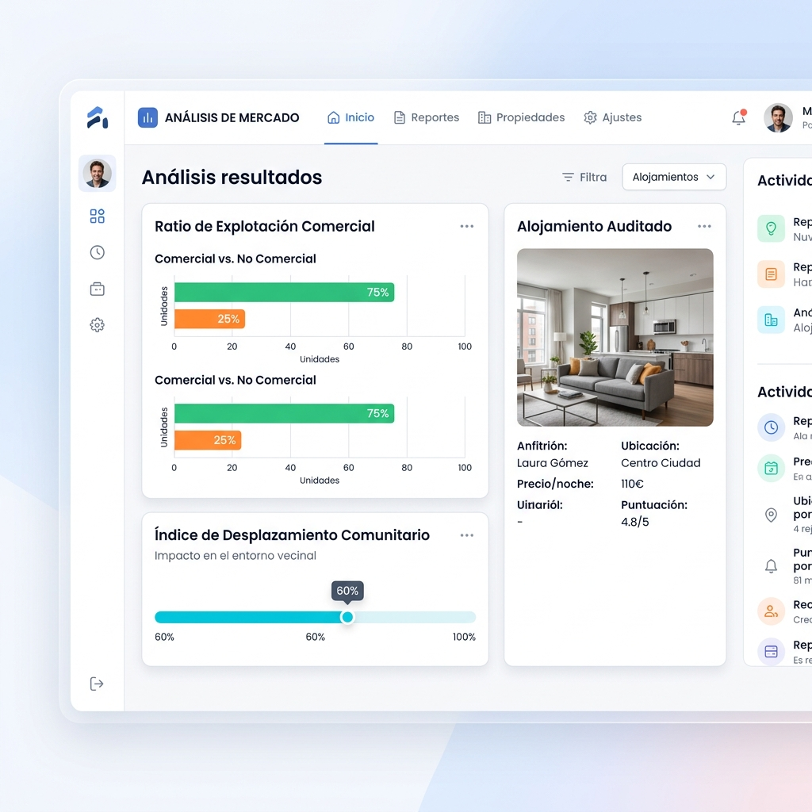

# 📖 Manual de Usuario: Especulómetro Vasco

Bienvenido al manual oficial del **Especulómetro Vasco**, una herramienta integral para auditar el impacto sociodemográfico de las Viviendas de Uso Turístico (VUT).

## 📑 Índice de Contenidos

1. [Visión General del Panel de Control](#1-visión-general-del-panel-de-control)
2. [Búsqueda y Auditoría de URLs](#2-búsqueda-y-auditoría-de-urls)
3. [Control Manual y Simulación](#3-control-manual-y-simulación)
4. [El Motor Predictivo: Módulos de Análisis](#4-el-motor-predictivo-módulos-de-análisis)
   - [Módulo 1: El Especulómetro](#módulo-1-el-especulómetro)
   - [Impacto y Consecuencias Sociales](#impacto-y-consecuencias-sociales)
   - [Diagnóstico IA](#diagnóstico-ia)

---

## 1. Visión General del Panel de Control

La interfaz del Especulómetro está diseñada para ofrecer una experiencia fluida e interactiva. Desde el panel principal, puedes acceder rápidamente tanto al análisis manual de datos como a la auditoría automatizada introduciendo la URL de una plataforma de alquiler.

*Figura 1: Vista general del dashboard principal, mostrando la barra de búsqueda y los controles manuales.*

---

## 2. Búsqueda y Auditoría de URLs

En la parte superior central de la aplicación encontrarás la barra de búsqueda principal. 

**¿Cómo funciona?**
1. Copia la URL de un anuncio desde plataformas como Airbnb o Booking.
2. Pégala en la barra de búsqueda.
3. Haz clic en **"Auditar URL"**.

El sistema se conectará en tiempo real, extraerá los datos del alojamiento, verificará su información contra las bases de datos del Eustat y ejecutará el análisis en nuestro motor de Inteligencia Artificial. Durante este proceso, verás una serie de estados de carga informándote de cada etapa de la extracción.

---

## 3. Control Manual y Simulación

Si prefieres realizar un estudio exploratorio o simular posibles escenarios, puedes utilizar la barra lateral izquierda (**Panel de Control**). 

Este panel te permite configurar manualmente diferentes variables:
- **Capital a Auditar:** Selecciona entre Bilbao, Donostia-San Sebastián o Vitoria-Gasteiz para ajustar el contexto socioeconómico.
- **Tarifa por Noche:** Ajusta el precio estimado de alquiler por noche.
- **Disponibilidad Anual:** Indica los días al año que el inmueble se encuentra bloqueado para el alquiler turístico.
- **Descripciones (NLP):** Puedes redactar el texto del anuncio y el perfil del anfitrión para que los algoritmos evalúen el comportamiento semántico del propietario.

Cualquier cambio que realices en estos controles actualizará instantáneamente las gráficas y análisis mostrados en la pantalla central.

---

## 4. El Motor Predictivo: Módulos de Análisis

Una vez ingresados los datos (vía URL o manualmente), el sistema despliega el resultado de sus tres módulos predictivos principales.

### Módulo 1: El Especulómetro

El panel central muestra un gráfico circular que evalúa la **Probabilidad de Especulación / Explotación Comercial**.
- Identifica si el propietario actúa bajo el radar operando múltiples pisos (comportamiento de Gran Tenedor).
- Alertas por color (Rojo, Amarillo, Verde) dependiendo del nivel de actividad profesional detectada.

### Impacto y Consecuencias Sociales

Debajo del panel principal, encontrarás dos métricas fundamentales sobre el impacto en el territorio:

*Figura 2: Paneles que detallan el impacto económico y el desplazamiento comunitario.*

1. **Ratio de Explotación Comercial:** Compara los ingresos mensuales estimados del piso operando como Vivienda de Uso Turístico versus si se alquilara a una familia en régimen residencial a largo plazo.
2. **Índice de Desplazamiento Comunitario:** Muestra el porcentaje de tiempo que el suelo residencial queda bloqueado al habitante local y detalla, con datos demográficos, la desertización comercial y pérdida de población joven en esa área.

### Diagnóstico IA

Por último, el sistema incorpora un motor LLM (Qwen) que evalúa todo el contexto del alojamiento y redacta un dictamen ejecutivo.

*Figura 3: Informe forense generado automáticamente por inteligencia artificial.*

- **Diagnóstico Ejecutivo Automático:** Provee un resumen en lenguaje natural explicando el riesgo, el nivel de profesionalización del anfitrión y si representa una amenaza para la accesibilidad a la vivienda en su entorno urbano.

---

*Fin del Manual. Para más detalles técnicos sobre el funcionamiento del pipeline de Machine Learning, consulta la documentación del código fuente o los notebooks interactivos.*
